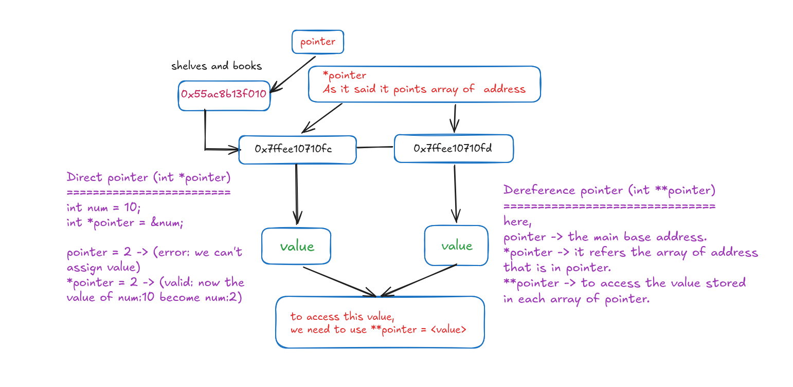

# 🧠 Understanding Pointers & Double Pointers in C

> My personal memory-backup notes — explained simply with real examples.

---

## 📦 The "Shelves and Books" Mental Model

Think of computer memory like a **library**:

- A **shelf** has a specific **address** (like `0x7ffee10710fc`)
- A **book** is the **value** stored at that shelf
- A **pointer** is like a **sticky note** that says *"go look at shelf #XYZ"*

---

## 🔵 What is a Pointer? (`int *pointer`)

A pointer is a variable that **stores a memory address** — not a value directly.

```c
int num = 10;
int *pointer = &num;
```

| Expression | What it means | Example value |
|---|---|---|
| `num` | The actual value | `10` |
| `&num` | The address of `num` | `0x7ffee10710fc` |
| `pointer` | Stores the address of `num` | `0x7ffee10710fc` |
| `*pointer` | The value AT that address | `10` |

### ✅ Valid vs ❌ Invalid

```c
pointer = 2;   // ❌ ERROR — you can't assign a plain number as an address
*pointer = 2;  // ✅ VALID — changes num's value from 10 → 2
```

The `*` in `*pointer = 2` means: *"go to the address stored in pointer, and change the value there."*

---

## 🔴 What is a Double Pointer? (`int **pointer`)

A double pointer is a pointer that **points to another pointer**.

In the diagram, imagine this setup:

```
pointer  →  0x55ac8b13f010   (base address — the "main shelf")
               ↓
         0x7ffee10710fc      (*pointer — an array of addresses)
         0x7ffee10710fd      (another address in the array)
               ↓
            value             (**pointer — the actual value)
```

### The Three Levels

| Expression | What it refers to |
|---|---|
| `pointer` | The **base address** — where the whole thing starts |
| `*pointer` | The **array of addresses** that `pointer` points to |
| `**pointer` | The **actual value** stored at each of those addresses |

### Code Example

```c
int a = 5;
int b = 10;

int *arr[2];     // an array of pointers
arr[0] = &a;     // arr[0] holds the address of a
arr[1] = &b;     // arr[1] holds the address of b

int **pointer = arr;   // pointer points to the array of pointers

// Accessing values:
printf("%d", **pointer);       // prints 5  (value of a)
printf("%d", **(pointer + 1)); // prints 10 (value of b)
```

---

## 🗺️ Visual Walkthrough (from the diagram)

```
[ pointer ]
     |
     ↓
[ 0x55ac8b13f010 ]  ← base address
     |
     ↓
[ 0x7ffee10710fc ] ←→ [ 0x7ffee10710fd ]   ← array of addresses (*pointer)
         |                     |
         ↓                     ↓
      [ value ]            [ value ]         ← actual data (**pointer)
```

To **read** a value: use `**pointer`  
To **write** a value: use `**pointer = <new_value>`

---

## 🧩 Quick Summary

| Concept | Syntax | Meaning |
|---|---|---|
| Regular variable | `int num` | Just holds a value |
| Pointer | `int *p = &num` | Holds the address of `num` |
| Dereference | `*p` | Gets the value at that address |
| Double pointer | `int **pp = &p` | Holds the address of a pointer |
| Double dereference | `**pp` | Gets the final value through two hops |

---

## 💡 One-Line Reminders

- `*` in a declaration = "this is a pointer"
- `*` when reading/writing = "go to the address and get/set the value there"
- `**` = two hops: pointer → pointer → value
- You **cannot** assign a raw number to a pointer directly (use `&` to get an address)

---

*Made with 💙 as a personal reference. Diagram drawn by hand to lock in the concept.*  
  
