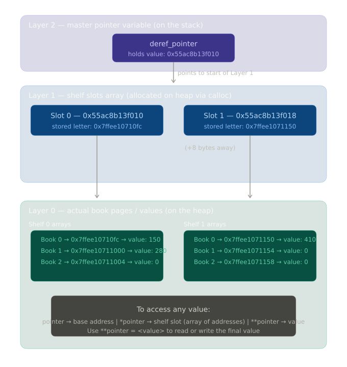
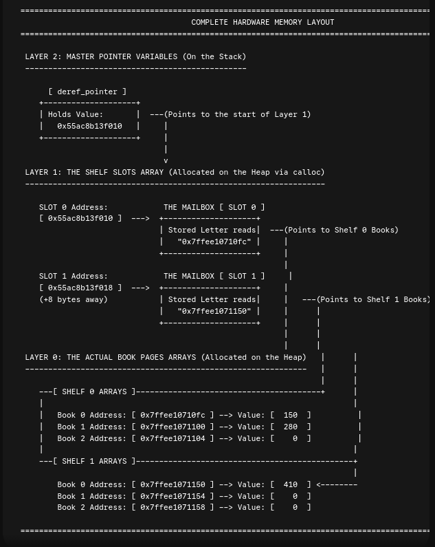

# 🧠 Complete Guide to Double Pointers (`**pointer`) in C

> Personal memory-backup notes — built layer by layer with real code and real addresses.

---

## 📐 The Architecture Diagram

<!-- 📎 Attach your 3-layer architecture diagram image here -->



---

## 📦 The "Shelves and Books" Mental Model

Think of computer memory like a **library**:

- A **shelf** has a specific **address** (like `0x7ffee10710fc`)
- A **book** is the **value** stored at that shelf
- A **pointer** is like a **sticky note** that says *"go look at shelf #XYZ"*

---

## 🗺️ The 3-Layer Memory Architecture

```
LAYER 2 — Master Pointer Variable (on the Stack)
─────────────────────────────────────────────────
  [ deref_pointer ]
  Holds Value: 0x55ac8b13f010  ──→  Points to the start of Layer 1
                    │
                    ▼
LAYER 1 — The Shelf Slots Array (allocated on the Heap via calloc)
─────────────────────────────────────────────────────────────────
  Slot 0 Address: 0x55ac8b13f010  →  Stored Letter: 0x7ffee10710fc  ──→  Points to Shelf 0 Books
  Slot 1 Address: 0x55ac8b13f018  →  Stored Letter: 0x7ffee1071150  ──→  Points to Shelf 1 Books
  (+8 bytes away)
                    │                          │
                    ▼                          ▼
LAYER 0 — The Actual Book Pages Arrays (allocated on the Heap)
──────────────────────────────────────────────────────────────
  SHELF 0 ARRAYS                    SHELF 1 ARRAYS
  Book 0 → 0x7ffee10710fc → 150     Book 0 → 0x7ffee1071150 → 410
  Book 1 → 0x7ffee10711000 → 280    Book 1 → 0x7ffee1071154 → 0
  Book 2 → 0x7ffee10711004 → 0      Book 2 → 0x7ffee1071158 → 0
```

---

## 🔵 Layer 2 — The Master Pointer (`deref_pointer`)

**No asterisk. Manages the master block.**

```c
int num = 10;
int *pointer = &num;
```

| Expression | What it means | Example value |
|---|---|---|
| `num` | The actual value | `10` |
| `&num` | The address of `num` | `0x7ffee10710fc` |
| `pointer` | Stores the address of `num` | `0x7ffee10710fc` |
| `*pointer` | The value AT that address | `10` |

### ✅ Valid vs ❌ Invalid

```c
pointer = 2;   // ❌ ERROR — you can't assign a plain number as an address
*pointer = 2;  // ✅ VALID — changes num's value from 10 → 2
```

The `*` in `*pointer = 2` means: *"go to the address stored in pointer, and change the value there."*

---

## 🟡 Layer 1 — The Shelf Slots (`*deref_pointer`)

**One asterisk. Access and change the shelf addresses.**

We break into Layer 1 to assign actual book arrays to our slots:

```c
*(deref_pointer + 0) = calloc(3, sizeof(int)); // Shelf 0 holds 3 books
*(deref_pointer + 1) = calloc(3, sizeof(int)); // Shelf 1 holds 3 books
```

This creates an array of pointer slots using `calloc`, and proves that **no matter which slot you're standing at, you can always walk back to the very first slot (the base address).**

### How the slots sit in memory

```
Slot [0] → [ address of Shelf 0 ]   ← deref_pointer points HERE (base address)
Slot [1] → [ address of Shelf 1 ]
```

> Each slot is **8 bytes apart** because each `int*` pointer is 8 bytes on a 64-bit system.

### Finding the base address from any slot

```c
for(int i = 0; i < arr_rows; i++) {
    int** current_slot_address = deref_pointer + i;   // move forward i steps
    int** calculated_base      = current_slot_address - i; // step back to base
}
```

**Output:**
```
Slot [0] Address: 0x55ac8b13f010 | Stepping back 0 slots -> Master Base: 0x55ac8b13f010
Slot [1] Address: 0x55ac8b13f018 | Stepping back 1 slots -> Master Base: 0x55ac8b13f010
Slot [2] Address: 0x55ac8b13f020 | Stepping back 2 slots -> Master Base: 0x55ac8b13f010
```

No matter how far forward you walk in the array, **subtracting the same number of steps always brings you back to the base address.**

---

## 🟢 Layer 0 — The Actual Book Values (`**deref_pointer`)

**Two asterisks. Access and change the actual book values.**

We smash through both walls to write data directly into the books:

```c
**(deref_pointer + 0)         = 150; // Sets Book 0 on Shelf 0 to 150
*(*(deref_pointer + 0) + 1)   = 280; // Sets Book 1 on Shelf 0 to 280
**(deref_pointer + 1)         = 410; // Sets Book 0 on Shelf 1 to 410
```

### The three levels

| Expression | What it refers to |
|---|---|
| `pointer` | The **base address** — where the whole thing starts |
| `*pointer` | The **array of addresses** that `pointer` points to |
| `**pointer` | The **actual value** stored at each of those addresses |

---

## 💻 Complete Code — All 3 Layers in One Script

```c
#include <stdlib.h>
#include <stdio.h>

int main() {
    // ==========================================
    // 1. USING 'deref_pointer' (No Asterisk)
    // Purpose: Create/Manage the master block
    // ==========================================
    int** deref_pointer = calloc(2, sizeof(int*));

    printf("--- LAYER 2: Master Pointer ---\n");
    printf("Base Address of Cabinet (deref_pointer): %p\n\n", (void*)deref_pointer);


    // ==========================================
    // 2. USING '*deref_pointer' (One Asterisk)
    // Purpose: Access and Change the Shelf Addresses
    // ==========================================
    // We break into Layer 1 to assign actual book arrays to our slots
    *(deref_pointer + 0) = calloc(3, sizeof(int)); // Shelf 0 holds 3 books
    *(deref_pointer + 1) = calloc(3, sizeof(int)); // Shelf 1 holds 3 books

    printf("--- LAYER 1: The Shelf Slots (Values inside slots) ---\n");
    printf("Slot 0 holds address (*(deref_pointer+0)): %p\n", (void*)*(deref_pointer + 0));
    printf("Slot 1 holds address (*(deref_pointer+1)): %p\n\n", (void*)*(deref_pointer + 1));


    // ==========================================
    // 3. USING '**deref_pointer' (Two Asterisks)
    // Purpose: Access and Change the Actual Book Values
    // ==========================================
    // We smash through both walls to write data directly into the books
    **(deref_pointer + 0)       = 150; // Sets Book 0 on Shelf 0 to 150 pages
    *(*(deref_pointer + 0) + 1) = 280; // Sets Book 1 on Shelf 0 to 280 pages
    **(deref_pointer + 1)       = 410; // Sets Book 0 on Shelf 1 to 410 pages

    printf("--- LAYER 0: The Actual Book Pages ---\n");
    printf("Shelf 0, Book 0 pages (**(deref_pointer+0)):     %d\n", **(deref_pointer + 0));
    printf("Shelf 0, Book 1 pages (*(*(deref_pointer+0)+1)): %d\n", *(*(deref_pointer + 0) + 1));
    printf("Shelf 1, Book 0 pages (**(deref_pointer+1)):     %d\n\n", **(deref_pointer + 1));


    // Clean up all memory blocks starting from bottom layers up
    free(*(deref_pointer + 0));
    free(*(deref_pointer + 1));
    free(deref_pointer);

    return 0;
}
```

---

## 📟 Terminal Output

```
--- LAYER 2: Master Pointer ---
Base Address of Cabinet (deref_pointer): 0x55ac8b13f010

--- LAYER 1: The Shelf Slots (Values inside slots) ---
Slot 0 holds address (*(deref_pointer+0)): 0x7ffee10710fc
Slot 1 holds address (*(deref_pointer+1)): 0x7ffee1071150

--- LAYER 0: The Actual Book Pages ---
Shelf 0, Book 0 pages (**(deref_pointer+0)):     150
Shelf 0, Book 1 pages (*(*(deref_pointer+0)+1)): 280
Shelf 1, Book 0 pages (**(deref_pointer+1)):     410
```

---

## ✅ Summary of Actions in the Code

1. `deref_pointer` — allocated the space for the tracking coordinates (Layer 2, master block on stack).
2. `*(deref_pointer + i)` — inserted the generated row addresses into those tracking slots (Layer 1, shelf slots on heap).
3. `**(deref_pointer + i)` — pasted the actual integers (`150`, `280`, `410`) into the destination memory cells (Layer 0, values on heap).

---

## 🧹 Memory Cleanup — Always Free Bottom-Up

```c
free(*(deref_pointer + 0)); // free Shelf 0's book array first
free(*(deref_pointer + 1)); // free Shelf 1's book array first
free(deref_pointer);        // then free the master cabinet last
```

`calloc` borrows memory from the system. `free` gives it back.
**Always free what you calloc, bottom layer first.** If you don't, the memory stays occupied even after your program ends — this is called a **memory leak**.

---

## 💡 Master Quick-Reference

| Syntax | Layer | What it does |
|---|---|---|
| `deref_pointer` | Layer 2 | Holds the base address of the whole cabinet |
| `*deref_pointer` | Layer 1 | Accesses the shelf slot (holds an address) |
| `**deref_pointer` | Layer 0 | Accesses the actual value stored in the book |
| `deref_pointer + i` | Layer 2 | Move forward `i` slots from the base |
| `*(deref_pointer + i)` | Layer 1 | The address stored in slot `i` |
| `**(deref_pointer + i)` | Layer 0 | The actual integer value at slot `i`, book 0 |
| `*(*(deref_pointer + i) + j)` | Layer 0 | The actual integer value at slot `i`, book `j` |

---

*Every slot knows where home is.* 🏠
